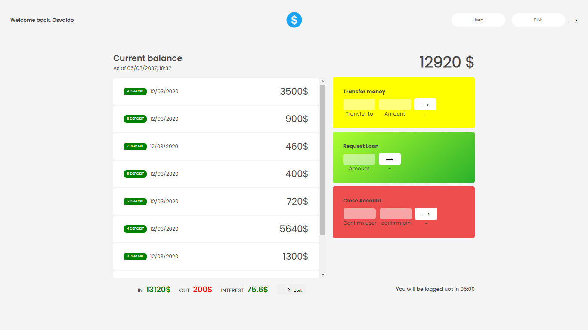

# Bankist Project 😎
   - ### Description: This project is about a simple bank
   - ### Version: 1.0
   - ### Author: Edvaldo Ch. Cariege
   - ### My contacts: 

# Technologies

 

## Github Page 👇

[Bankist](https://osvaldocariege06.github.io/bankist-v1.0/)

